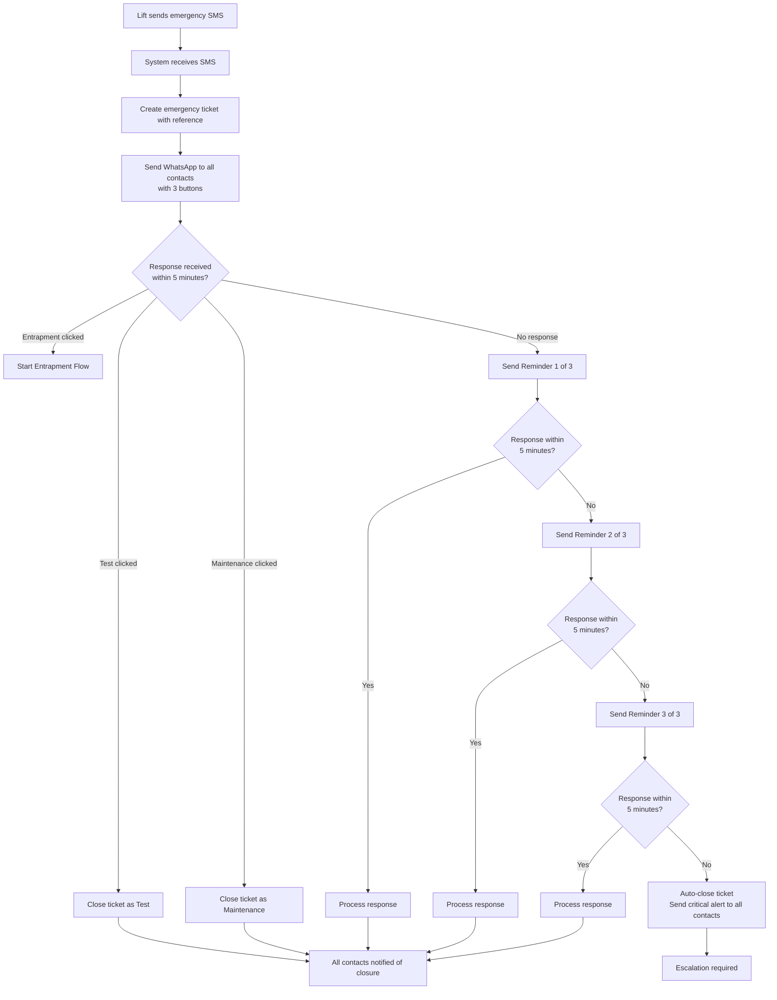
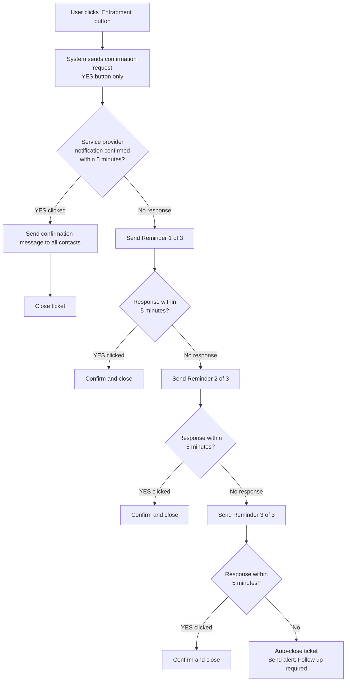

# MyBuildings/DTS/Woosh Ai Lift WhatsApp System
## Project Specification Document

---

## Executive Summary

The MyBuildings/DTS/Woosh Ai Lift WhatsApp System is an automated emergency response system designed for lift maintenance and emergency communications across South African properties. The system receives emergency alerts via SMS from lift units and immediately notifies building contacts through WhatsApp with interactive response buttons, creating a fast, trackable, and accountable emergency response workflow.

---

## System Overview

### Purpose

This system provides an automated communication bridge between lift emergency systems and building management contacts. When a lift sends an emergency SMS, the system:

1. Creates a unique tracked emergency ticket
2. Sends WhatsApp messages with interactive buttons to all registered contacts
3. Tracks responses and follows up automatically if no response is received
4. Manages different emergency types (Test, Maintenance, Entrapment)
5. Ensures accountability through automated reminders and escalations

### Key Features

- **Instant Response**: Emergency alerts trigger immediate WhatsApp notifications to all contacts
- **Interactive Buttons**: Simple one-tap responses (Test/Maintenance/Entrapment)
- **Unique Ticket References**: Each emergency gets a human-readable reference (e.g., BUILDING-TKT123)
- **Automated Follow-ups**: System sends reminders if no response is received
- **Entrapment Confirmation**: Special workflow requiring confirmation that service providers have been notified
- **Multiple Simultaneous Emergencies**: Handles multiple active emergencies across different lifts independently
- **Full Audit Trail**: Every message and response is logged with timestamps

---

## System Components

### 1. SMS Portal Integration
The system receives emergency SMS messages from lift units via SMS Portal, a South African SMS gateway provider.

### 2. WhatsApp Messaging (Woosh Ai)
All notifications and interactive messages are delivered via WhatsApp Business using Woosh Ai's messaging platform. WhatsApp provides:
- Instant delivery
- Read receipts
- Interactive button responses
- Rich message formatting

### 3. Ticket Management System
Each emergency creates a unique ticket with:
- Ticket reference (e.g., PARKVIEW-TKT45)
- Lift location details
- Timestamp
- Status tracking
- Response history

---

## Emergency Flows

### Flow 1: Initial Emergency Alert



#### Step-by-Step Process

**Step 1: Emergency SMS Received**
- Lift unit sends SMS from its registered phone number
- System identifies the lift and its registered contacts
- A unique ticket is created immediately

**Step 2: WhatsApp Alert Sent**
- All contacts receive a WhatsApp message containing:
  - Ticket reference (e.g., [PARKVIEW-TKT45])
  - Lift location (site and building name)
  - Three action buttons: Test | Maintenance | Entrapment
- Timer starts for 5-minute response window

**Step 3: Initial Response Window (5 minutes)**
- Contacts have 5 minutes to click a button
- Any contact can respond (first response counts)
- If "Test" or "Maintenance" clicked: Ticket closes, all contacts notified
- If "Entrapment" clicked: Proceeds to Entrapment Flow
- If no response: System sends Reminder 1

**Step 4: Reminder 1 (if no response)**
- Same message resent with all 3 buttons
- New 5-minute window begins
- If still no response: Reminder 2 sent

**Step 5: Reminder 2 (if no response)**
- Same message resent with all 3 buttons
- New 5-minute window begins
- If still no response: Reminder 3 sent

**Step 6: Reminder 3 (if no response)**
- Final reminder sent with all 3 buttons
- New 5-minute window begins
- If still no response: Auto-close with critical escalation

**Step 7: Auto-Close After 3 Reminders**
- Ticket automatically closed
- Critical alert sent to all contacts:
  - "⚠️ CRITICAL ALERT: Emergency ticket auto-closed... NO RESPONSE received after 3 reminders. IMMEDIATE ACTION REQUIRED."
- Manual follow-up required

---

### Flow 2: Entrapment Emergency



#### Step-by-Step Process

**Step 1: Entrapment Confirmed**
- Contact clicks "Entrapment" button on initial alert
- System marks this as a critical entrapment situation
- Opens 24-hour WhatsApp session for interactive messaging

**Step 2: Service Provider Confirmation Request**
- System sends follow-up message to all contacts:
  - "Has the service provider been notified of the entrapment at [Location]?"
  - Single YES button for confirmation
- Timer starts for 5-minute response window

**Step 3: Confirmation Response Window (5 minutes)**
- Any contact can click YES to confirm service provider notification
- If YES clicked: Confirmation message sent, ticket closed
- If no response: Reminder 1 sent

**Step 4: Reminders (if no confirmation)**
- Reminder 1: "⚠️ REMINDER 1/3: Please confirm that the service provider has been notified..."
- Reminder 2: Same message format (2/3)
- Reminder 3: Final reminder (3/3)
- Each reminder includes YES button
- 5-minute window after each reminder

**Step 5: Auto-Close After 3 Reminders**
- If no confirmation received after 3 reminders:
  - Ticket auto-closes with note: "Auto-closed: Service provider notification not confirmed after 3 reminders"
  - Alert sent to all contacts: "⚠️ ALERT: Ticket auto-closed... Please follow up immediately."
  - Manual verification required

**Step 6: Successful Confirmation**
- When YES clicked at any point:
  - Confirmation message: "We have received a 'Yes' response. The service provider has been notified and this ticket has been closed."
  - Message sent to all contacts
  - Ticket closed successfully

---

## Ticketing System

### Ticket Reference Format

Each emergency receives a unique ticket reference in the format:
- **BUILDING-TKT{ID}**

Examples:
- PARKVIEW-TKT123
- MAINLIFT-TKT45
- LIFT7-TKT892

The ticket reference appears in:
- All WhatsApp messages
- System logs
- Audit trails
- Status reports

### Purpose of Ticket References

1. **Clarity in Multi-Emergency Scenarios**: When multiple lifts have simultaneous emergencies, ticket references ensure contacts know exactly which emergency they're responding to

2. **Audit Trail**: Every action is linked to a specific ticket for accountability

3. **Follow-up Management**: Building managers can reference specific tickets when coordinating with service providers

4. **Status Tracking**: Easy to track which emergencies are open, closed, or awaiting response

---

## Timing and Reminders

### Initial Alert Reminders

| Stage | Timing | Action |
|-------|--------|--------|
| Initial Alert | Immediate | WhatsApp sent on SMS receipt |
| First Response Window | 5 minutes | Wait for button click |
| Reminder 1 | After 5 min (no response) | Resend with all buttons |
| Second Response Window | 5 minutes | Wait for button click |
| Reminder 2 | After 5 min (no response) | Resend with all buttons |
| Third Response Window | 5 minutes | Wait for button click |
| Reminder 3 | After 5 min (no response) | Final reminder with all buttons |
| Final Response Window | 5 minutes | Wait for button click |
| Auto-Close | After 5 min (no response) | Critical escalation alert |

**Total Time to Auto-Close**: 20 minutes (4 × 5-minute windows)

### Entrapment Confirmation Reminders

| Stage | Timing | Action |
|-------|--------|--------|
| Confirmation Request | Immediate | After "Entrapment" clicked |
| First Response Window | 5 minutes | Wait for YES confirmation |
| Reminder 1 | After 5 min (no response) | "REMINDER 1/3" with YES button |
| Second Response Window | 5 minutes | Wait for YES confirmation |
| Reminder 2 | After 5 min (no response) | "REMINDER 2/3" with YES button |
| Third Response Window | 5 minutes | Wait for YES confirmation |
| Reminder 3 | After 5 min (no response) | "REMINDER 3/3" with YES button |
| Final Response Window | 5 minutes | Wait for YES confirmation |
| Auto-Close | After 5 min (no response) | Follow-up alert sent |

**Total Time to Auto-Close**: 20 minutes (4 × 5-minute windows)

### Background Processing

The system runs an automated check every 60 seconds to:
- Identify tickets awaiting reminders
- Send due reminders
- Process auto-closures
- Update ticket statuses

---

## Contact Management

### Contact Registration

Each lift is associated with one or more contacts who will receive emergency notifications. Contacts are registered with:
- Name
- WhatsApp-enabled phone number
- Role (e.g., Tenant, Building Manager)
- Association with specific lifts

### Multi-Contact Support

- All registered contacts for a lift receive simultaneous notifications
- Any contact can respond to an emergency
- First response is recorded and all contacts are notified
- Ensures redundancy if primary contact is unavailable

---

## Handling Multiple Emergencies

The system is designed to handle multiple simultaneous emergencies across different lifts:

### Independent Tracking
- Each lift emergency creates a separate ticket
- Ticket references keep emergencies distinct
- Reminders and responses are tracked per ticket

### Example Scenario

**Scenario**: Two lifts have emergencies at the same time

**Lift 7 (Parkview)**:
- Emergency SMS received at 10:00
- Ticket created: LIFT7-TKT101
- WhatsApp sent: "Emergency alert [LIFT7-TKT101] at Parkview, Lift 7"
- Contact clicks "Maintenance" at 10:02
- Ticket LIFT7-TKT101 closed

**Lift 3 (Sandton)**:
- Emergency SMS received at 10:01
- Ticket created: LIFT3-TKT102
- WhatsApp sent: "Emergency alert [LIFT3-TKT102] at Sandton, Lift 3"
- No response by 10:06
- Reminder 1 sent for LIFT3-TKT102
- Contact clicks "Entrapment" at 10:08
- Entrapment flow begins for LIFT3-TKT102

Both emergencies are tracked independently with their own timelines, reminders, and resolution paths.

---

## Message Examples

### Initial Emergency Alert

```
🚨 Emergency Alert [PARKVIEW-TKT123]

Location: Parkview Tower, Main Lift

Please respond by selecting the appropriate action below:

[Test] [Maintenance] [Entrapment]
```

### Reminder Message

```
⚠️ REMINDER 1/3 - Emergency Alert [PARKVIEW-TKT123]

Location: Parkview Tower, Main Lift

No response received. Please respond immediately:

[Test] [Maintenance] [Entrapment]
```

### Entrapment Confirmation Request

```
Has the service provider been notified of the entrapment at Parkview Tower, Main Lift?

[YES]
```

### Auto-Close Critical Alert

```
⚠️ CRITICAL ALERT: Emergency ticket [PARKVIEW-TKT123] has been auto-closed due to NO RESPONSE received after 3 reminders. IMMEDIATE ACTION REQUIRED.

Location: Parkview Tower, Main Lift
```

---

## Benefits

### For Building Management
- **Instant Awareness**: Know immediately when a lift has an emergency
- **Quick Response Options**: One-tap buttons reduce response time
- **Accountability**: Automated reminders ensure nothing is missed
- **Clear Communication**: Ticket references prevent confusion
- **Audit Trail**: Full history of every emergency and response

### For Service Providers
- **Clear Instructions**: Ticket references for coordination
- **Status Visibility**: Know when emergencies are resolved
- **Entrapment Protocol**: Structured process for critical situations

### For Tenants
- **Confidence**: Automated system ensures emergencies are handled
- **Transparency**: Can see response status through ticket references
- **Safety**: Special entrapment flow for critical situations

---

## System Requirements

### For Lift Units
- SMS-capable emergency button system
- Registered phone number (SIM card)

### For Contacts
- WhatsApp installed on smartphone
- Active WhatsApp account
- Phone number registered in system

### Network Requirements
- Reliable cellular network for SMS
- Internet connection for WhatsApp (mobile data or WiFi)

---

## Support and Administration

The system includes an administrative interface for:
- Adding and managing lift registrations
- Managing contact details
- Viewing ticket history
- Accessing message logs
- Monitoring system status

---

## South African Context

The system is specifically designed for the South African market:
- Integrates with South African SMS provider (SMS Portal)
- Uses South African phone number format (+27)
- Operates on South African cellular networks
- WhatsApp-first approach (high WhatsApp penetration in SA)
- Time zones and timestamps in South African Standard Time (SAST)

---

## System Flow Diagrams

The complete system flow diagrams are available in two formats:

1. **Separate Mermaid Files** (for use in diagram editors):
   - `EMERGENCY_FLOW_DIAGRAM.mmd` - Complete emergency management flow with all reminders and closures
   - These files can be opened in any Mermaid-compatible editor or documentation system

2. **Embedded Diagrams** (shown below for reference):

Below is the complete Mermaid code embedded in this document:

### Complete Emergency Management Flow

```mermaid
flowchart TD
    Start([Lift Emergency SMS]) --> CreateTicket[Create Ticket with Reference<br/>e.g. BUILDING-TKT123]
    CreateTicket --> SendInitial[Send WhatsApp to All Contacts<br/>Test | Maintenance | Entrapment]
    
    SendInitial --> Wait1{Response<br/>within<br/>5 min?}
    
    Wait1 -->|Test| CloseTest[Close as Test<br/>Notify all contacts]
    Wait1 -->|Maintenance| CloseMaint[Close as Maintenance<br/>Notify all contacts]
    Wait1 -->|Entrapment| EntrapFlow[Start Entrapment Flow]
    Wait1 -->|No Response| Rem1[Send Reminder 1/3<br/>All 3 buttons]
    
    Rem1 --> Wait2{Response<br/>within<br/>5 min?}
    Wait2 -->|Any Button| Process1[Process Response]
    Wait2 -->|No Response| Rem2[Send Reminder 2/3<br/>All 3 buttons]
    
    Rem2 --> Wait3{Response<br/>within<br/>5 min?}
    Wait3 -->|Any Button| Process2[Process Response]
    Wait3 -->|No Response| Rem3[Send Reminder 3/3<br/>All 3 buttons]
    
    Rem3 --> Wait4{Response<br/>within<br/>5 min?}
    Wait4 -->|Any Button| Process3[Process Response]
    Wait4 -->|No Response| AutoClose[Auto-Close Ticket<br/>CRITICAL ALERT to all contacts]
    
    EntrapFlow --> SendConfirm[Send Confirmation Request<br/>YES button only]
    SendConfirm --> WaitYes1{YES<br/>within<br/>5 min?}
    
    WaitYes1 -->|YES| Confirmed[Service Provider Confirmed<br/>Close ticket, notify all]
    WaitYes1 -->|No Response| RemYes1[Send Reminder 1/3<br/>YES button]
    
    RemYes1 --> WaitYes2{YES<br/>within<br/>5 min?}
    WaitYes2 -->|YES| Confirmed
    WaitYes2 -->|No Response| RemYes2[Send Reminder 2/3<br/>YES button]
    
    RemYes2 --> WaitYes3{YES<br/>within<br/>5 min?}
    WaitYes3 -->|YES| Confirmed
    WaitYes3 -->|No Response| RemYes3[Send Reminder 3/3<br/>YES button]
    
    RemYes3 --> WaitYes4{YES<br/>within<br/>5 min?}
    WaitYes4 -->|YES| Confirmed
    WaitYes4 -->|No Response| AutoCloseEntrap[Auto-Close Ticket<br/>Alert: Follow up required]
    
    CloseTest --> End([Ticket Closed])
    CloseMaint --> End
    Process1 --> End
    Process2 --> End
    Process3 --> End
    AutoClose --> End
    Confirmed --> End
    AutoCloseEntrap --> End
    
    style Start fill:#ff6b6b
    style CreateTicket fill:#4ecdc4
    style SendInitial fill:#ffe66d
    style EntrapFlow fill:#ff6b6b
    style AutoClose fill:#ff0000,color:#fff
    style AutoCloseEntrap fill:#ff0000,color:#fff
    style Confirmed fill:#95e1d3
    style End fill:#95e1d3
```

---

## Document Version

**Version**: 1.0  
**Date**: 1 October 2025  
**System**: MyBuildings/DTS/Woosh Ai Lift WhatsApp System
