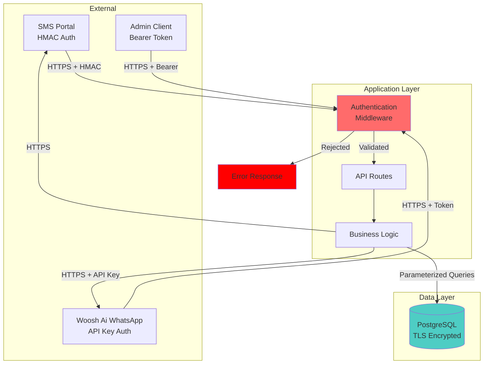

# MyBuildings/DTS/Woosh Ai Lift WhatsApp System
## Technical Security Documentation

---

## Document Overview

This document provides a comprehensive technical overview of the security architecture, authentication mechanisms, data protection strategies, and threat mitigation measures implemented in the MyBuildings/DTS/Woosh Ai Lift WhatsApp System. This documentation is intended for security auditors, technical compliance teams, and information security professionals.

---

## Security Architecture Overview

### Multi-Layer Security Model

The system implements defence-in-depth security across multiple layers:

1. **Transport Layer Security**: All external communications use TLS 1.2+ encryption
2. **Authentication Layer**: Token-based authentication for administrative and webhook endpoints
3. **Authorization Layer**: Single-token authentication for administrative functions (no role-based access control)
4. **Data Layer**: PostgreSQL with encrypted connections and parameterized queries
5. **Application Layer**: Input validation, rate limiting, and error handling

### Zero-Trust Principles

- No implicit trust between system components
- All endpoints require explicit authentication
- Minimal privilege principle applied throughout
- Continuous verification of requests

---

## Authentication Mechanisms

### 1. Administrative Authentication

**Method**: Bearer Token Authentication

**Implementation**:
- Token-based authentication using cryptographically secure random tokens
- Tokens stored as environment variables, never in code or version control
- Multiple authentication header support:
  - `Authorization: Bearer <token>`
  - `X-Admin-Token: <token>`

**Token Requirements**:
- Minimum 32 characters
- High entropy (recommended: 256-bit random value)
- Rotatable without system downtime
- Single token model (simplified credential management)

**Protected Endpoints**:
- `/admin/*` - All administrative operations
- Lift management (CREATE, UPDATE, DELETE)
- Contact management (CREATE, UPDATE, DELETE)
- Message history access
- System configuration

**Security Considerations**:
- Token transmitted over HTTPS only
- Partial token logging on startup (first 8 characters) - should be removed for production hardening
- Failed authentication attempts logged for monitoring
- No timing attack vulnerabilities in token comparison

### 2. SMS Webhook Authentication

**Method**: HMAC-SHA256 Signature Verification

**Implementation**:
- Inbound SMS webhooks from SMS Portal verified using HMAC signatures
- Shared secret stored as environment variable (`SMSPORTAL_HMAC_SECRET`)
- Request body signed with shared secret
- Signature included in webhook headers

**Verification Process**:
```
1. Extract signature from webhook header
2. Compute HMAC-SHA256 of raw request body using shared secret
3. Compare computed signature with provided signature
4. Reject request if signatures don't match
```

**Security Benefits**:
- Prevents webhook spoofing
- Ensures message integrity (tampering detection)
- Validates sender authenticity
- No replay attack vulnerability (when combined with timestamp validation)

**Fallback Behaviour**:
- If HMAC secret not configured, webhook processing continues (development mode)
- Production deployments must configure HMAC secrets

### 3. WhatsApp Webhook Authentication

**Method**: Bearer Token Authentication

**Implementation**:
- Inbound WhatsApp webhooks from Woosh Ai authenticated via bearer token
- Dedicated webhook authentication token (`WEBHOOK_AUTH_TOKEN`)
- Separate from administrative token (principle of least privilege)

**Protected Endpoint**:
- `/webhooks/whatsapp` - WhatsApp interactive button responses

**Security Considerations**:
- Token validation occurs before any business logic processing
- Unauthorized requests logged with source IP
- Failed authentication returns generic 401 response (no information leakage)
- Token rotatable independently of admin credentials

### 4. WhatsApp Business API Authentication

**Method**: API Key Authentication

**Implementation**:
- Outbound WhatsApp messages authenticated via API key header
- API key provided by Woosh Ai, stored as environment variable (`BRIDGE_API_KEY`)
- Header varies by endpoint:
  - Template and text messages (`/v1/send`): `x-tenant-key: <key>`
  - Interactive messages (`/api/messages/send`): `X-Api-Key: <key>`

**Security Benefits**:
- Prevents unauthorized use of WhatsApp Business API
- Rate limiting enforced by provider
- API key rotatable through provider portal

**Note**: Header inconsistency exists for historical reasons; both headers authenticate with the same API key value

---

## Data Protection

### Database Security

**Connection Security**:
- PostgreSQL connections over TLS/SSL
- Connection string stored as environment variable (`DATABASE_URL`)
- SSL mode enforcement for production environments
- Connection pooling with secure credential management

**Query Security**:
- 100% parameterized queries (no string concatenation)
- Protection against SQL injection attacks
- Database user principle of least privilege
- No direct SQL execution from user input

**Data Storage**:
- Sensitive data (phone numbers) stored without formatting characters
- Contact information includes: names, phone numbers, roles
- Message content logged for audit purposes
- Ticket lifecycle tracked with timestamps

**Database Access Control**:
- Administrative interface requires authentication
- No public database endpoints
- Read-only vs. read-write separation where applicable

### Secrets Management

**Environment Variables**:
All sensitive credentials stored as environment variables:
- `ADMIN_TOKEN` - Administrative authentication
- `BRIDGE_API_KEY` - WhatsApp API authentication
- `BRIDGE_TEMPLATE_NAME` - WhatsApp template identifier
- `BRIDGE_TEMPLATE_LANG` - Template language code
- `SMSPORTAL_HMAC_SECRET` - SMS webhook verification
- `WEBHOOK_AUTH_TOKEN` - WhatsApp webhook authentication
- `DATABASE_URL` - PostgreSQL connection string

**Secret Protection**:
- Never logged or printed in application output
- Not committed to version control
- Rotatable without code changes
- Separate secrets for different authentication contexts

**Secret Rotation**:
- All secrets can be rotated independently
- No shared secrets between authentication contexts
- Rolling rotation supported (update environment, restart service)

### Data in Transit

**External Communications**:
- All HTTP communications over TLS 1.2+
- Certificate validation enforced
- No fallback to unencrypted connections

**API Integrations**:
- SMS Portal: HTTPS with HMAC verification
- Woosh Ai WhatsApp Business: HTTPS with API key authentication
- No plaintext credential transmission

### Data at Rest

**Database Encryption**:
- Database provider responsible for encryption at rest
- Compatible with Neon, Supabase, Railway (all support encryption at rest)
- Backup encryption handled by provider

**Application Storage**:
- No sensitive data cached in application memory beyond request lifecycle
- Temporary debugging buffers (development only) cleared on restart

---

## Input Validation and Sanitization

### Phone Number Validation

**Normalization**:
- All phone numbers normalized to E.164 format without `+` symbol
- Example: `+27 82 123 4567` → `27821234567`
- Prevents duplicate entries due to formatting differences

**Validation Rules**:
- Must match South African phone number format
- Length validation (10-15 digits)
- Numeric characters only after normalization

### Message Content Validation

**SMS Processing**:
- Maximum message length enforced
- Character encoding validation (UTF-8)
- No code execution from message content

**WhatsApp Processing**:
- Template-based messaging only (prevents injection attacks)
- User input limited to button clicks (predefined options)
- No arbitrary message content from external sources

### API Input Validation

**Request Validation**:
- Content-Type verification
- Request size limits enforced
- JSON schema validation for structured data
- Parameter type checking
- Required field validation

**Sanitization**:
- HTML/JavaScript escaping for any user-provided content
- SQL injection prevention via parameterized queries
- Path traversal prevention in file operations

---

## Error Handling and Information Disclosure

### Secure Error Responses

**Production Error Handling**:
- Generic error messages to external clients
- No stack traces exposed to end users
- No database error details in responses
- No internal path information disclosed

**Development vs. Production**:
- Detailed errors logged server-side only
- Environment-based error verbosity
- Stack traces logged but never returned in HTTP responses

**HTTP Status Codes**:
- `401 Unauthorized` - Authentication failures
- `403 Forbidden` - Authorization failures
- `404 Not Found` - Resource not found
- `409 Conflict` - Constraint violations (e.g., duplicate entries)
- `500 Internal Server Error` - Generic server errors

### Logging and Monitoring

**Security Event Logging**:
- Authentication failures logged with timestamp and source
- Webhook authentication failures logged
- Database constraint violations logged
- Administrative actions logged with user context

**Log Security**:
- No sensitive credentials logged
- Phone numbers logged for audit purposes (POPIA compliance considerations apply)
- Request/response logging with configurable verbosity
- Logs retained for audit trail purposes

**Monitoring Capabilities**:
- Request logging via middleware
- Error rate monitoring
- Database query performance logging
- External API call success/failure tracking

---

## API Security

### Rate Limiting

**Considerations**:
- SMS webhooks: Rate limited by SMS Portal infrastructure
- WhatsApp webhooks: Rate limited by Woosh Ai infrastructure
- Administrative endpoints: Application-level rate limiting recommended for production

### Request Timeout Protection

**Timeout Configuration**:
- Outbound API calls: 30-second timeout
- Prevents resource exhaustion from hung connections
- Graceful failure handling on timeout

### CORS Configuration

**Cross-Origin Resource Sharing**:
- Administrative interface served from same origin
- No CORS required for API endpoints (server-to-server only)
- If CORS needed, restricted to specific origins only

---

## Threat Model and Mitigations

### Threat: Unauthorized Administrative Access

**Attack Vector**: Attacker attempts to access administrative endpoints

**Mitigations**:
- Strong token-based authentication
- HTTPS-only communication
- Token rotation capability
- Failed access logging

**Risk Level**: Low (with proper token management)

### Threat: Webhook Spoofing

**Attack Vector**: Attacker sends fake SMS or WhatsApp webhooks

**Mitigations**:
- HMAC signature verification for SMS webhooks
- Bearer token authentication for WhatsApp webhooks
- Request validation and sanitization
- Source IP logging

**Risk Level**: Low (with HMAC and token authentication)

### Threat: SQL Injection

**Attack Vector**: Attacker injects SQL through user input

**Mitigations**:
- 100% parameterized queries
- No dynamic SQL construction
- Input validation and type checking
- Database user least privilege

**Risk Level**: Very Low (parameterized queries prevent injection)

### Threat: Man-in-the-Middle Attacks

**Attack Vector**: Attacker intercepts network traffic

**Mitigations**:
- TLS 1.2+ encryption for all communications
- Certificate validation enforced
- No fallback to unencrypted protocols
- HTTPS-only cookie flags (if cookies used)

**Risk Level**: Very Low (TLS mandatory)

### Threat: Credential Exposure

**Attack Vector**: API keys or tokens exposed in logs, code, or version control

**Mitigations**:
- Environment variable storage
- No credentials in code or version control
- Secure logging (no credential logging)
- Secret rotation capability

**Risk Level**: Low (with proper secrets management)

### Threat: Denial of Service

**Attack Vector**: Attacker floods endpoints with requests

**Mitigations**:
- External rate limiting at infrastructure level
- Request timeout enforcement
- Connection pooling limits
- Provider-level DDoS protection (SMS Portal, Woosh Ai)

**Risk Level**: Medium (dependent on infrastructure)

### Threat: Ticket Confusion in Multi-Emergency Scenarios

**Attack Vector**: Attacker or system bug causes button responses to affect wrong ticket

**Mitigations**:
- Unique message ID tracking per ticket
- Context.id matching for precise ticket identification
- Transaction-based ticket updates
- Audit trail of all ticket actions

**Risk Level**: Very Low (robust message tracking architecture)

### Threat: Replay Attacks

**Attack Vector**: Attacker captures and resends valid webhook requests

**Mitigations**:
- HMAC signatures prevent request modification
- Timestamp validation recommended (not currently implemented)
- Idempotency considerations in business logic

**Risk Level**: Medium (timestamp validation would reduce to Low)

---

## Compliance Considerations

### POPIA (Protection of Personal Information Act) - South Africa

#### Personal Information Collected

**Data Categories**:
- Contact identity information: Names, roles
- Contact information: Phone numbers (formatted for SMS and WhatsApp)
- Communication records: Message content, timestamps, response actions
- Operational data: Ticket references, lift locations, emergency types
- System metadata: IP addresses in logs, authentication timestamps

**Purpose Limitation**:
All personal information collected serves the specific, explicitly defined purpose of:
- Emergency lift incident notification and response
- Building management communication
- Audit trail for compliance and safety
- System troubleshooting and performance monitoring

**Lawful Processing Basis**:
- **Legitimate Interest** (primary): Emergency response and building safety management
- **Consent** (secondary): Contacts registered with explicit knowledge of system purpose and function
- **Legal Obligation**: Potential building safety regulations requiring emergency communication systems

#### Data Subject Rights (POPIA Section 23-25)

**1. Right of Access**:
- Data subjects can request access to their personal information via administrator
- Administrative interface provides complete message history per contact
- Response timeframe: Within POPIA-mandated period (reasonable time, not exceeding 30 days)

**2. Right to Correction**:
- Contact details (name, phone number) updatable via admin interface
- Incorrect lift associations can be modified
- Historical message records are immutable for audit integrity

**3. Right to Deletion/Erasure**:
- Contact records deletable via admin interface
- Cascading delete: Removes lift_contacts associations automatically
- Message history linked to deleted contacts retained for audit purposes with contact reference removed
- Retention considerations: Emergency response audit requirements vs. erasure rights

**4. Right to Object**:
- Data subjects can object to processing via administrator
- Objection may limit ability to receive emergency notifications
- Administrator responsible for assessing objection validity vs. safety obligations

**5. Right to Data Portability**:
- Contact information and message history exportable via admin API
- JSON format provided for data portability
- Covers all personal information held by system

#### Data Minimization and Purpose Limitation

**Minimal Data Collection**:
- Only essential identity and contact information collected
- No sensitive personal information collected (race, religion, health, etc.)
- Message content limited to operational emergency communications
- No behavioral profiling or secondary data analysis

**Purpose Limitation**:
- Data used solely for emergency notification system
- No marketing, commercial use, or unrelated secondary purposes
- Administrative access logged and auditable

#### Security Safeguards (POPIA Section 19)

**Technical Measures**:
- TLS 1.2+ encryption for all data in transit
- PostgreSQL encryption at rest (provider-dependent)
- Token-based authentication for all system access
- HMAC verification for webhook authenticity
- Parameterized queries preventing SQL injection
- Input validation and sanitization

**Organizational Measures**:
- Access restricted to authenticated administrators only
- Administrative actions logged with timestamps
- Secret rotation procedures documented
- Incident response procedures defined (see below)

#### Data Retention and Destruction

**Retention Policy**:
- **Contact Information**: Retained while contact is active in system
- **Message History**: Indefinite retention for audit purposes (should be defined per business requirements)
- **Event Logs**: Indefinite retention for security monitoring (should be defined per business requirements)
- **Recommendation**: Define retention periods aligned with:
  - Building safety regulation requirements
  - Insurance/liability considerations
  - POPIA principle of limited retention

**Destruction Method**:
- Database record deletion (PostgreSQL DELETE operations)
- Cascading deletes for referential integrity
- Database provider responsible for storage-level destruction
- Backup retention follows database provider policy

**Retention Schedule Recommendation**:
- Active contacts: Retained while service agreement active
- Closed tickets: 5-7 years (aligned with typical safety record retention)
- System logs: 2 years minimum for security incident investigation
- Automated deletion: Should be implemented based on defined retention policy

#### Cross-Border Data Transfer

**Current Configuration**:
- Database hosting location configurable (Neon, Supabase, Railway)
- South African data center options available via all providers
- No mandatory cross-border data transfer

**Transborder Information Flow Compliance (POPIA Section 72)**:
- If database hosted outside South Africa:
  - Ensure provider has adequate data protection (adequacy assessment)
  - Contractual safeguards with database provider required
  - Data subject notification of cross-border transfer recommended
- Recommendation: Use South African database regions for POPIA compliance simplicity

**Third-Party Processors**:
- **SMS Portal**: South African provider, data remains in SA
- **Woosh Ai**: WhatsApp Business API provider - confirm data residency
- **Database Provider**: Configurable region - select South African data center
- **Meta/WhatsApp**: End-to-end encrypted messages, Meta operates globally

#### Responsible Party vs. Operator Classification

**System Owner/Deployer** (Responsible Party under POPIA):
- Determines purpose and means of processing
- Responsible for POPIA compliance obligations
- Must register as Responsible Party with Information Regulator
- Liable for data protection compliance

**System Operator** (if applicable):
- If system managed by third-party on behalf of owner
- Processes data per Responsible Party instructions only
- Must have written agreement defining responsibilities
- Subject to Operator obligations under POPIA Section 21

**Third-Party Processors**:
- SMS Portal, Woosh Ai, Database Provider act as Operators
- Processing agreements must be in place
- Operators must maintain adequate security safeguards
- Responsible Party retains primary POPIA compliance accountability

#### Incident Response and Data Breach Notification

**Breach Definition**:
Any compromise of the security leading to accidental or unlawful destruction, loss, alteration, unauthorized disclosure of, or access to personal information.

**Incident Detection**:
- Failed authentication attempt logging
- Unusual access pattern monitoring
- Database query anomaly detection
- Webhook authentication failure tracking
- Regular security log review

**Breach Response Procedure**:

1. **Immediate Actions (0-24 hours)**:
   - Isolate affected systems
   - Rotate compromised credentials immediately
   - Assess scope of data exposure
   - Document incident timeline and evidence
   - Engage incident response team/procedures

2. **Assessment (24-72 hours)**:
   - Determine personal information affected
   - Identify number of data subjects impacted
   - Assess harm potential (identity theft, financial loss, reputational damage, etc.)
   - Evaluate if breach meets notification threshold

3. **Notification Obligations (POPIA Section 22)**:
   - **Information Regulator**: Notify "as soon as reasonably possible" if breach likely to cause harm
   - **Data Subjects**: Notify affected individuals if breach likely to cause harm
   - **Notification Content**: Describe breach, categories of data, likely consequences, measures taken, contact information

4. **Remediation and Lessons Learned**:
   - Implement corrective measures
   - Update security procedures
   - Document incident and response
   - Review and improve security controls

**Notification Thresholds**:
- Unauthorized access to contact database: **Notify**
- Exposure of message history: **Notify**
- Authentication token compromise without data access: **Assess and likely notify**
- Failed authentication attempts (no breach): **Log only, no notification**

#### POPIA Compliance Checklist for Deployers

- [ ] Register as Responsible Party with Information Regulator (if processing for own purposes)
- [ ] Define and document retention periods for all personal information
- [ ] Implement automated deletion based on retention policy
- [ ] Execute processing agreements with third-party processors (SMS Portal, Woosh Ai, database provider)
- [ ] Conduct Privacy Impact Assessment for system
- [ ] Create data subject rights request procedures (access, correction, deletion, objection)
- [ ] Configure database in South African region (or document adequacy assessment for offshore)
- [ ] Implement incident response and breach notification procedures
- [ ] Train administrators on POPIA obligations and data handling
- [ ] Document lawful basis for processing and maintain records
- [ ] Provide privacy notice to data subjects (contacts) explaining processing
- [ ] Remove partial API key logging from startup logs (production hardening)
- [ ] Schedule regular POPIA compliance audits

---

## Security Best Practices for Deployment

### Environment Configuration

1. **Generate Strong Secrets**:
   ```bash
   # Generate 256-bit random tokens
   openssl rand -base64 32
   ```

2. **Separate Secrets per Environment**:
   - Different tokens for development, staging, production
   - Never reuse secrets across environments

3. **Secret Rotation Schedule**:
   - Administrative tokens: Rotate quarterly or on personnel changes
   - Webhook tokens: Rotate biannually
   - API keys: Rotate per provider recommendations

### Database Security

1. **Connection String Security**:
   - Use SSL mode: `?sslmode=require`
   - Dedicated database user per environment
   - Strong database passwords (16+ characters, high entropy)

2. **Database Access**:
   - Restrict network access to database
   - Firewall rules limiting connection sources
   - Database audit logging enabled

3. **Backup Security**:
   - Encrypted backups
   - Secure backup storage
   - Tested restoration procedures

### Network Security

1. **HTTPS Configuration**:
   - TLS 1.2 minimum
   - Strong cipher suites only
   - HSTS headers recommended

2. **Firewall Configuration**:
   - Restrict administrative endpoints to trusted networks
   - Allow webhook sources (SMS Portal, Woosh Ai)
   - Default deny policy

### Monitoring and Alerting

1. **Security Monitoring**:
   - Failed authentication attempts
   - Unusual traffic patterns
   - Error rate spikes
   - Database performance anomalies

2. **Alert Configuration**:
   - Real-time alerts for authentication failures
   - Threshold-based alerts for error rates
   - Regular security log review

### Incident Response

1. **Token Compromise**:
   - Immediately rotate affected token
   - Review logs for unauthorized access
   - Assess scope of potential data exposure

2. **Webhook Compromise**:
   - Rotate webhook authentication tokens
   - Review recent webhook activity
   - Coordinate with provider (SMS Portal or Woosh Ai)

3. **Database Compromise**:
   - Isolate database immediately
   - Assess data exposure
   - Engage incident response procedures
   - Notify affected parties per POPIA requirements

---

## API Security Headers

### Recommended HTTP Security Headers

```
Strict-Transport-Security: max-age=31536000; includeSubDomains
X-Content-Type-Options: nosniff
X-Frame-Options: DENY
X-XSS-Protection: 1; mode=block
Content-Security-Policy: default-src 'self'
Referrer-Policy: no-referrer
```

### Current Implementation

- `X-Content-Type-Options: nosniff` (via Express defaults)
- Additional headers should be configured per deployment requirements

---

## Third-Party Security Dependencies

### SMS Portal

**Security Responsibilities**:
- SMS delivery infrastructure security
- HMAC secret management (shared responsibility)
- Network security for webhook delivery

**Trust Assumptions**:
- SMS Portal infrastructure is secure
- HMAC implementation is correct
- SMS delivery is reliable

### Woosh Ai (WhatsApp Business API)

**Security Responsibilities**:
- WhatsApp Business API integration security
- API key management (shared responsibility)
- Webhook delivery security
- WhatsApp message encryption (end-to-end)

**Trust Assumptions**:
- Woosh Ai infrastructure is secure
- API key protection by provider
- WhatsApp's end-to-end encryption (Meta-provided)

### Database Providers (Neon/Supabase/Railway)

**Security Responsibilities**:
- Database infrastructure security
- Encryption at rest
- Network security
- Backup encryption
- Access controls

**Trust Assumptions**:
- Provider implements industry-standard database security
- Encryption is properly implemented
- Provider access is audited and logged

---

## Security Testing Recommendations

### Authentication Testing

- [ ] Test authentication bypass attempts
- [ ] Test token brute-force resistance
- [ ] Test authentication header variations
- [ ] Test expired/invalid token handling

### Authorization Testing

- [ ] Test access to protected endpoints without authentication
- [ ] Test privilege escalation attempts
- [ ] Test cross-user data access

### Input Validation Testing

- [ ] SQL injection testing (automated and manual)
- [ ] Cross-site scripting (XSS) testing
- [ ] Command injection testing
- [ ] Path traversal testing
- [ ] Malformed request handling

### Webhook Security Testing

- [ ] Test webhook spoofing attempts
- [ ] Test HMAC signature validation
- [ ] Test replay attack scenarios
- [ ] Test malformed webhook payloads

### Error Handling Testing

- [ ] Test information disclosure in errors
- [ ] Test stack trace exposure
- [ ] Test database error exposure
- [ ] Test path information leakage

---

## Security Audit Checklist

### Pre-Deployment Security Review

- [ ] All secrets stored as environment variables
- [ ] Strong tokens generated (minimum 32 characters)
- [ ] HTTPS enforced for all endpoints
- [ ] Database SSL enabled
- [ ] HMAC secret configured for SMS webhooks
- [ ] Webhook authentication token configured
- [ ] Administrative token rotation schedule defined
- [ ] Security logging enabled
- [ ] Error handling configured for production (no stack traces exposed)
- [ ] Input validation implemented for all endpoints
- [ ] Rate limiting configured
- [ ] Monitoring and alerting configured
- [ ] Incident response procedures documented
- [ ] POPIA compliance assessed
- [ ] Backup and restore procedures tested

### Ongoing Security Operations

- [ ] Quarterly token rotation
- [ ] Monthly security log review
- [ ] Quarterly dependency vulnerability scanning
- [ ] Annual penetration testing
- [ ] Annual security architecture review
- [ ] Continuous monitoring of authentication failures
- [ ] Regular backup verification

---

## Vulnerability Disclosure

### Responsible Disclosure

If security vulnerabilities are identified:

1. Do not exploit vulnerabilities in production systems
2. Document the vulnerability with proof-of-concept (if safe)
3. Report to system administrators immediately
4. Allow reasonable time for remediation before public disclosure
5. Coordinate disclosure timeline with system owner

---

## Security Architecture Diagram



---

## Document Version

**Version**: 1.0  
**Date**: 1 October 2025  
**Classification**: Technical Security Documentation  
**System**: MyBuildings/DTS/Woosh Ai Lift WhatsApp System

---

## Appendix: Security Terminology

**Authentication**: Verification of identity (who are you?)  
**Authorization**: Verification of permissions (what can you do?)  
**HMAC**: Hash-based Message Authentication Code - cryptographic signature for message integrity  
**TLS**: Transport Layer Security - encryption protocol for secure communication  
**SQL Injection**: Attack technique inserting malicious SQL through user input  
**Bearer Token**: Authentication token transmitted in HTTP Authorization header  
**Parameterized Query**: SQL query using placeholders instead of string concatenation  
**Rate Limiting**: Restricting number of requests per time period  
**POPIA**: South African data protection legislation  
**E.164**: International phone number format standard  
**End-to-End Encryption**: Encryption where only sender and recipient can decrypt messages
